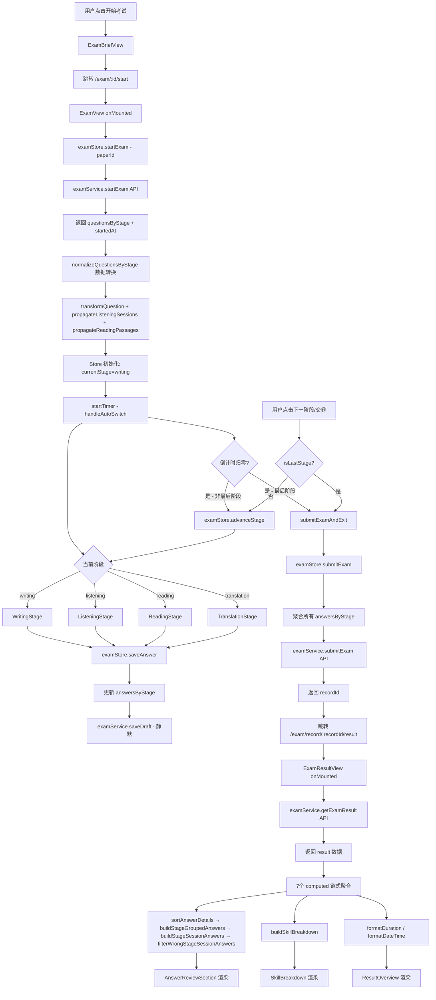
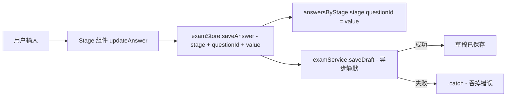
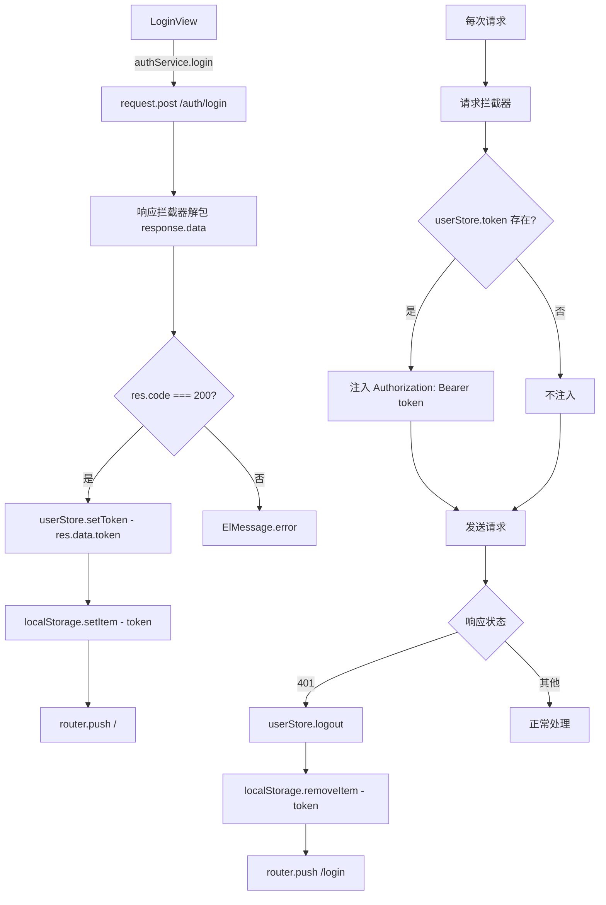

# CET4 前端项目体检报告与分阶段重构计划

> 文档版本：v1.0  
> 生成日期：2026-05-01  
> 项目：cet4-frontend  
> 技术栈：Vue 3 + Vite + Pinia + Element Plus + Vue Router + Axios

---

## 目录

1. [项目体检报告](#1-项目体检报告)
2. [重构风险矩阵](#2-重构风险矩阵)
3. [分阶段重构计划](#3-分阶段重构计划)
4. [决策记录](#4-决策记录)

---

## 1. 项目体检报告

### 1.1 技术栈清单

| 分类 | 技术 | 版本 | 说明 |
|------|------|------|------|
| 框架 | Vue | ^3.5.32 | Composition API + `<script setup>` |
| 构建工具 | Vite | ^8.0.8 | 开发服务器 + 生产构建 |
| 状态管理 | Pinia | ^3.0.4 | Options Store + Setup Store 混用 |
| 持久化 | pinia-plugin-persistedstate | ^4.7.1 | token / examId 持久化 |
| 路由 | Vue Router | ^5.0.4 | History 模式 + beforeEach 守卫 |
| UI 库 | Element Plus | ^2.13.7 | 按需自动导入 |
| 图标 | @element-plus/icons-vue | ^2.3.2 | — |
| HTTP | Axios | ^1.15.2 | 自定义封装 |
| 图表 | ECharts | ^6.0.0 | 已安装但未在当前代码中使用 |
| 自动导入 | unplugin-auto-import | ^21.0.0 | Element Plus API 自动导入 |
| 组件自动导入 | unplugin-vue-components | ^32.0.0 | Element Plus 组件自动导入 |
| 开发工具 | vite-plugin-vue-devtools | ^8.1.1 | — |
| Vue 插件 | @vitejs/plugin-vue | ^6.0.6 | SFC 编译 |
| Node 引擎 | — | ^20.19.0 \|\| >=22.12.0 | — |

**缺失项**：ESLint、Prettier、Husky、Commitlint、测试框架、TypeScript。

### 1.2 路由地图

| 路径 | 名称 | 组件 | 守卫 | 懒加载 |
|------|------|------|------|--------|
| `/` | — | 重定向到 `/exam` | — | — |
| `/login` | login | `LoginView.vue` | 已登录则跳转 `/exam` | ✅ |
| `/register` | register | `RegisterView.vue` | 无 | ✅ |
| `/exam` | exam-list | `ExamListView.vue` | requiresAuth | ✅ |
| `/exam/records` | exam-records | `ExamRecordListView.vue` | requiresAuth | ✅ |
| `/exam/:id/brief` | exam-brief | `ExamBriefView.vue` | requiresAuth | ✅ |
| `/exam/:id/start` | exam-start | `ExamView.vue` | requiresAuth | ✅ |
| `/exam/record/:recordId/result` | exam-result-record | `ExamResultView.vue` | requiresAuth | ✅ |
| `/exam/result/:examId` | exam-result | `ExamResultView.vue` | requiresAuth | ✅ |

**守卫逻辑**（`router.beforeEach`）：

```
if (to.meta.requiresAuth && !userStore.token) → 重定向 /login
if (to.path === '/login' && userStore.token) → 重定向 /exam
其他 → 放行
```

**问题点**：
- `/register` 路由未设置「已登录则跳转首页」逻辑，已登录用户仍可访问注册页
- 两条结果页路由指向同一组件，参数名不一致（`recordId` vs `examId`），组件内需兼容处理
- 无 404 兜底路由
- 无路由过渡动画配置

### 1.3 状态管理地图

#### `useUserStore`（Setup Store）

| 职责 | 状态/方法 | 说明 |
|------|-----------|------|
| 登录态 | `token` | 手动读写 localStorage，未使用 persist 插件 |
| 用户信息 | `userInfo` | 仅声明，未在任何地方赋值 |
| 设置 Token | `setToken()` | 同步写 localStorage |
| 登出 | `logout()` | 清空 token + userInfo |

**问题点**：
- `token` 持久化方式与 `examStore` 不一致——手动操作 localStorage 而非使用 persist 插件
- `userInfo` 始终为 null，登录成功后未获取/存储用户信息
- 登出时未清理 `examStore` 的持久化数据

#### `useExamStore`（Options Store）

| 职责 | 状态/方法 | 说明 |
|------|-----------|------|
| 考试标识 | `examId` | 持久化到 localStorage |
| 试卷元数据 | `paperMeta` | 未使用 |
| 阶段控制 | `currentStage` / `stageStartedAt` / `stageDuration` | 阶段切换与计时 |
| 题目数据 | `questionsByStage` | 按 stage 分组的题目列表 |
| 答题数据 | `answersByStage` | 按 stage 分组的答案映射 |
| 听力播放 | `listeningPlayed` | 标记已播放的听力题 |
| 提交状态 | `isSubmitted` / `isLoading` | 流程控制 |
| 开始考试 | `startExam()` | 调 API + 初始化状态 + 数据转换 |
| 恢复考试 | `resumeExam()` | 仅设置 examId，未恢复完整状态 |
| 保存答案 | `saveAnswer()` | 更新本地 + 异步草稿 API（静默失败） |
| 标记播放 | `markListeningPlayed()` | — |
| 阶段推进 | `advanceStage()` | 切换下一阶段 + 重置计时 |
| 交卷 | `submitExam()` | 聚合答案 + 调 API |
| 重置 | `resetExam()` | 恢复初始状态 |
| 计算属性 | `remainingSeconds` / `currentQuestions` / `currentAnswers` / `hasActiveExam` / `stageOrder` | — |
| 重导出 | `buildSectionGroups` / `buildSessionGroups` / `getListeningSectionInfo` / `STAGE_DURATIONS` | 从 utils/constants 透传 |

**问题点**：
- **职责过重**：同时承担考试流程控制、阶段切换、答题状态、草稿保存、交卷、结果数据聚合
- **重导出反模式**：Store 不应是 utils 函数的透传层，消费者应直接引用 utils
- **草稿保存静默失败**：`saveAnswer()` 中 `.catch(() => {})` 吞掉所有错误
- **resumeExam 不完整**：仅设置 examId，未恢复题目、答案、阶段等状态
- **remainingSeconds 重复计算**：Store getter 和 `useExamTimer` composable 各算一遍
- **persist 配置仅持久化 examId**：页面刷新后其他状态丢失，但 examId 仍在，导致不一致

### 1.4 请求层地图

#### 拦截器链路

```
请求发出 → 请求拦截器（注入 Authorization: Bearer {token}）→ 服务端
服务端响应 → 响应拦截器（解包 response.data）→ 业务层
异常响应 → 响应拦截器（401 → logout + 跳登录页）→ Promise.reject
```

#### `request.js` 封装

| 配置项 | 值 | 说明 |
|--------|-----|------|
| baseURL | `VITE_API_BASE_URL \|\| '/api'` | 开发环境走 Vite proxy |
| timeout | `VITE_REQUEST_TIMEOUT \|\| 10000` | 10 秒超时 |
| 请求拦截 | 注入 Bearer Token | 从 userStore 读取 |
| 响应拦截-成功 | `response => response.data` | 直接解包 data 层 |
| 响应拦截-失败 | 401 → logout + push /login | 无刷新 Token 机制 |

#### Service 层

| 服务 | 方法 | HTTP | 路径 | 返回处理 |
|------|------|------|------|----------|
| `authService` | `login()` | POST | `/auth/login` | — |
| `authService` | `register()` | POST | `/auth/register` | — |
| `examService` | `getExamList()` | GET | `/exam` | `.then(res => res.data)` |
| `examService` | `getExamRecords()` | GET | `/exam/records` | `.then(res => res.data)` |
| `examService` | `startExam()` | POST | `/exam/start` | — |
| `examService` | `saveDraft()` | PUT | `/exam/draft` | — |
| `examService` | `submitExam()` | POST | `/exam/submit` | — |
| `examService` | `getExamResult()` | GET | `/exam/records/{id}/result` | — |

**问题点**：
- **响应解包不一致**：响应拦截器已解包 `response.data`，但 `getExamList` / `getExamRecords` 又做 `.then(res => res.data)`，实际拿到的是 `response.data.data`；而 `startExam` 等方法返回的是 `response.data`（即原始 `data` 字段）
- **无统一错误码处理**：仅处理 401，其他业务错误码（如 403、500）未分层处理
- **无请求重试机制**：网络波动场景下草稿保存可能丢失
- **无请求取消**：组件卸载时未取消进行中的请求
- **Vite proxy 硬编码**：`/api` 代理到 `localhost:8080`，无环境区分

### 1.5 组件复杂度评估

| 组件 | 行数 | 复杂度 | 核心问题 |
|------|------|--------|----------|
| `ExamView.vue` | 194 | 🔴 高 | 容器组件，编排4个阶段 + 计时器 + 自动切换 + 交卷逻辑，多状态交织 |
| `ExamResultView.vue` | 228 | 🔴 高 | 7个 computed 链式聚合，数据转换逻辑重，直接调 examService |
| `ListeningStage.vue` | 367 | 🔴 高 | 音频播放控制 + 禁暂停逻辑 + 自动播放 + 分组展示，UI 与业务混合 |
| `ReadingStage.vue` | 307 | 🟡 中 | 三种题型渲染 + 分组逻辑，直接访问 store 答案状态 |
| `ExamHeader.vue` | 317 | 🟡 中 | 步骤进度 + 答题进度 + 计时器，独立使用 useExamTimer |
| `ExamRecordListView.vue` | 265 | 🟡 中 | 表格 + 格式化 + 退出逻辑，样式占比大 |
| `ExamBriefView.vue` | 300 | 🟡 中 | 数据获取 + 展示，含硬编码规则文案 |
| `AnswerReviewSection.vue` | 289 | 🟡 中 | 客观题/主观题双模板，样式复杂 |
| `LoginView.vue` | 109 | 🟢 低 | 表单 + 登录逻辑，职责清晰 |
| `RegisterView.vue` | 158 | 🟢 低 | 表单 + 校验 + 注册逻辑 |
| `ExamListView.vue` | 142 | 🟢 低 | 列表渲染 + 跳转 |
| `WritingStage.vue` | 43 | 🟢 低 | 纯展示 + 答案绑定 |
| `TranslationStage.vue` | 42 | 🟢 低 | 纯展示 + 答案绑定 |
| `ResultOverview.vue` | 91 | 🟢 低 | 纯展示组件 |
| `SkillBreakdown.vue` | 86 | 🟢 低 | 纯展示组件 |
| `AiFeedbackPanel.vue` | 108 | 🟢 低 | 结构化/纯文本双模式展示 |
| `ExamSessionCard.vue` | 67 | 🟢 低 | 通用卡片容器 |
| `QuestionOptionList.vue` | 126 | 🟢 低 | 选项列表 + 键盘交互 |
| `TextAnswerQuestion.vue` | 94 | 🟢 低 | 文本答题组件 |
| `PageTopBar.vue` | 61 | 🟢 低 | 通用顶部栏 |
| `AuthLayout.vue` | 60 | 🟢 低 | 登录注册布局 |
| `HomeView.vue` | 132 | 🟢 低 | 首页 mock 展示 |

### 1.6 工程化缺口清单

| 类别 | 现状 | 缺口 |
|------|------|------|
| 代码规范 | 无 ESLint / Prettier | 无统一代码风格，无自动格式化 |
| Git 规范 | 无 Husky / Commitlint | 无提交信息规范，无 pre-commit 检查 |
| 测试 | 无测试框架 / 无用例 | 核心业务逻辑零测试保护 |
| 类型安全 | 纯 JavaScript | 无 TypeScript，无 JSDoc 类型标注 |
| CI/CD | 无配置 | 无自动化构建 / 测试 / 部署流水线 |
| 环境管理 | 仅 Vite proxy 硬编码 | 无 .env 多环境配置体系 |
| 构建优化 | 基础 Vite 配置 | 无分包策略、无压缩优化、无构建分析 |
| 监控 | 无 | 无错误上报、无性能监控 |
| 文档 | README.md 仅脚手架默认内容 | 无 API 文档、无组件文档 |

### 1.7 核心数据流图

#### 考试完整流程



#### 答题数据流



#### 鉴权数据流



---

## 2. 重构风险矩阵

### 2.1 文件改动影响与风险等级

| 文件 | 改动类型 | 风险等级 | 影响范围 | 依赖该文件的消费者 |
|------|----------|----------|----------|-------------------|
| `src/stores/exam.js` | 拆分职责 / 移除重导出 | 🔴 高 | 全部考试流程页面 | ExamView, ExamHeader, 4个 Stage 组件, ExamResultView |
| `src/utils/questionTransform.js` | 移至领域层 | 🟡 中 | examStore, 间接影响所有 Stage | examStore.normalizeQuestionsByStage |
| `src/utils/examGrouping.js` | 移至领域层 | 🟡 中 | ReadingStage, ListeningStage, examResult | 2个 Stage 组件, examResult.buildStageSessionAnswers |
| `src/utils/examResult.js` | 移至领域层 | 🟡 中 | ExamResultView | ExamResultView 的 7 个 computed |
| `src/utils/request.js` | 增强拦截器 | 🟡 中 | 全部 API 调用 | examService, authService |
| `src/services/examService.js` | 统一返回结构 | 🟡 中 | ExamView, ExamResultView, ExamListView, ExamBriefView, ExamRecordListView | 5 个 View 组件 |
| `src/services/authService.js` | 统一返回结构 | 🟢 低 | LoginView, RegisterView | 2 个 View 组件 |
| `src/stores/user.js` | 统一持久化方式 | 🟢 低 | 路由守卫, request.js, ExamListView, ExamRecordListView | 多处但改动简单 |
| `src/router/index.js` | 补充守卫 / 404 | 🟢 低 | 全局路由 | 所有页面 |
| `src/views/exam/ExamView.vue` | 容器/展示分离 | 🔴 高 | 考试主流程 | 路由 |
| `src/views/exam/ExamResultView.vue` | 数据聚合下沉 | 🔴 高 | 结果页 | 路由 |
| `src/components/exam/stages/ListeningStage.vue` | 音频逻辑抽取 | 🟡 中 | 听力阶段 | ExamView |
| `src/components/exam/stages/ReadingStage.vue` | 容器/展示分离 | 🟡 中 | 阅读阶段 | ExamView |
| `src/components/exam/ExamHeader.vue` | 计时器逻辑统一 | 🟡 中 | 考试头部 | ExamView |
| `src/composables/useExamTimer.js` | 与 Store 去重 | 🟡 中 | ExamView, ExamHeader | 2 个组件 |
| `src/constants/exam.js` | 拆分/整理 | 🟢 低 | 多处引用 | examStore, ExamHeader, ExamBriefView, examResult |
| `src/utils/answer.js` | 移至领域层 | 🟢 低 | AnswerReviewSection | 1 个组件 |
| `src/utils/feedback.js` | 移至领域层 | 🟢 低 | AiFeedbackPanel | 1 个组件 |
| `src/utils/date.js` | 移至领域层 | 🟢 低 | ExamResultView, ExamRecordListView | 2 个组件 |
| `src/views/HomeView.vue` | 清理 mock 数据 | 🟢 低 | 首页 | 路由 |

### 2.2 文件间依赖关系图

```mermaid
flowchart TD
    subgraph 视图层
        EV[ExamView.vue]
        ERV[ExamResultView.vue]
        EBV[ExamBriefView.vue]
        ELV[ExamListView.vue]
        ERLV[ExamRecordListView.vue]
        LV[LoginView.vue]
        RV[RegisterView.vue]
        HV[HomeView.vue]
    end

    subgraph 组件层
        EH[ExamHeader.vue]
        WS[WritingStage.vue]
        LS[ListeningStage.vue]
        RS[ReadingStage.vue]
        TS[TranslationStage.vue]
        RO[ResultOverview.vue]
        SB[SkillBreakdown.vue]
        ARS[AnswerReviewSection.vue]
        AFP[AiFeedbackPanel.vue]
    end

    subgraph Store层
        ES[examStore]
        US[userStore]
    end

    subgraph 服务层
        examSrv[examService]
        authSrv[authService]
    end

    subgraph 工具层
        QT[questionTransform]
        EG[examGrouping]
        ER[examResult]
        ANS[answer]
        FB[feedback]
        DT[date]
    end

    subgraph 基础层
        REQ[request.js]
        CONST[constants/exam]
        TIMER[useExamTimer]
    end

    EV --> ES
    EV --> EH
    EV --> WS
    EV --> LS
    EV --> RS
    EV --> TS
    EV --> TIMER

    EH --> ES
    EH --> TIMER
    EH --> CONST

    LS --> ES
    LS --> EG
    RS --> ES
    RS --> EG
    WS --> ES
    TS --> ES

    ERV --> examSrv
    ERV --> ER
    ERV --> DT
    ERV --> RO
    ERV --> SB
    ERV --> ARS

    ARS --> ANS
    ARS --> ER
    ARS --> AFP
    AFP --> FB

    ERV --> RO
    SB --> CONST

    ES --> QT
    ES --> EG
    ES --> CONST
    ES --> examSrv

    ELV --> examSrv
    ELV --> US
    ERLV --> examSrv
    ERLV --> US
    ERLV --> DT
    EBV --> examSrv
    EBV --> CONST

    LV --> authSrv
    LV --> US
    RV --> authSrv

    examSrv --> REQ
    authSrv --> REQ
    REQ --> US

    ER --> EG
    ER --> CONST
    EG --> CONST
```



---

## 3. 分阶段重构计划

### 阶段 1：工程化底座补强

**目标**：建立代码规范与提交规范基础设施，为后续重构提供安全网。

**前置条件**：无

**改动范围**：

| 文件 | 操作 |
|------|------|
| `package.json` | 新增 devDependencies + scripts |
| `eslint.config.js` | 新建 |
| `.prettierrc.json` | 新建 |
| `.prettierignore` | 新建 |
| `.husky/pre-commit` | 新建 |
| `.husky/commit-msg` | 新建 |
| `commitlint.config.js` | 新建 |
| `.editorconfig` | 新建 |
| `.env.development` | 新建 |
| `.env.production` | 新建 |
| `src/constants/request.js` | 适配环境变量 |

**执行步骤**：

1. 安装依赖：`eslint`、`@eslint/js`、`eslint-plugin-vue`、`prettier`、`eslint-config-prettier`、`eslint-plugin-prettier`、`husky`、`@commitlint/cli`、`@commitlint/config-conventional`
2. 配置 ESLint：使用 Vue 3 推荐规则 + Prettier 兼容，暂不开启严格规则，仅 warning
3. 配置 Prettier：单引号、无分号、2 空格缩进、行宽 100
4. 配置 Husky：pre-commit 运行 `eslint --fix`，commit-msg 运行 commitlint
5. 配置 commitlint：使用 conventional 规范
6. 在 `package.json` 添加脚本：`lint`、`lint:fix`、`format`、`prepare`
7. 对现有代码执行一次 `eslint --fix` + `prettier --write`，修复所有可自动修复的问题
8. 创建 `.env.development` 和 `.env.production`，将 `VITE_API_BASE_URL` 和 `VITE_REQUEST_TIMEOUT` 从硬编码迁移到环境变量
9. 更新 `src/constants/request.js` 使用环境变量

**验收标准**：

- [ ] `npm run lint` 可正常执行，0 error（warning 允许）
- [ ] `npm run format` 可正常执行
- [ ] git commit 时 pre-commit 钩子触发 ESLint 检查
- [ ] 不符合 conventional 规范的 commit message 被拒绝
- [ ] `.env.development` 和 `.env.production` 配置就绪
- [ ] 现有代码经自动修复后无 ESLint error

**回退方案**：

- 删除 `eslint.config.js`、`.prettierrc.json`、`commitlint.config.js`
- 删除 `.husky` 目录
- 移除 `package.json` 中新增的 devDependencies 和 scripts
- `git revert` 自动格式化的提交

---

### 阶段 2：请求层与鉴权边界收敛

**目标**：统一请求/响应结构，修复响应解包不一致，完善鉴权流程。

**前置条件**：阶段 1 完成

**改动范围**：

| 文件 | 操作 |
|------|------|
| `src/utils/request.js` | 修改拦截器逻辑 |
| `src/services/examService.js` | 统一返回结构 |
| `src/services/authService.js` | 统一返回结构 |
| `src/stores/user.js` | 统一持久化方式 |
| `src/router/index.js` | 补充守卫逻辑 + 404 |
| `src/views/LoginView.vue` | 适配新响应结构 |
| `src/views/RegisterView.vue` | 适配新响应结构 |
| `src/views/exam/ExamListView.vue` | 适配新响应结构 |
| `src/views/exam/ExamBriefView.vue` | 适配新响应结构 |
| `src/views/exam/ExamRecordListView.vue` | 适配新响应结构 |
| `src/views/exam/ExamView.vue` | 适配新响应结构 |
| `src/views/exam/ExamResultView.vue` | 适配新响应结构 |

**执行步骤**：

1. **统一响应拦截器**：修改 `request.js` 响应拦截器，成功时返回完整 `response.data`（包含 code/data/message），不再自动解包到 data 内部
2. **定义响应类型约定**：在 `src/constants/request.js` 中添加响应码常量（如 `RES_CODE_SUCCESS = 200`）
3. **统一 Service 层返回**：所有 service 方法返回完整响应体，由调用方按 `res.code` 判断；移除 `examService.getExamList` 和 `getExamRecords` 中多余的 `.then(res => res.data)`
4. **增强错误处理**：在响应拦截器中增加业务错误码分层处理（403 禁止访问、500 服务器错误等），统一 `ElMessage.error` 提示
5. **修复 userStore 持久化**：改用 `pinia-plugin-persistedstate` 的 `persist` 选项替代手动 localStorage 操作，与 examStore 保持一致
6. **完善路由守卫**：
   - `/register` 路由增加已登录跳转首页逻辑
   - 添加 404 兜底路由
   - 登出时清理 examStore 持久化数据
7. **逐个适配 View 组件**：根据新的响应结构更新各 View 中的数据读取逻辑

**验收标准**：

- [ ] 所有 service 方法返回结构一致（`{ code, data, message }`）
- [ ] 无双重解包问题（不再出现 `res.data.data`）
- [ ] 401/403/500 等错误码有统一处理
- [ ] userStore 使用 persist 插件持久化 token
- [ ] 已登录用户无法访问 `/login` 和 `/register`
- [ ] 未知路由跳转 404 页面或重定向首页
- [ ] 登出时清理所有持久化状态
- [ ] 所有页面功能正常

**回退方案**：

- 还原 `request.js` 拦截器为 `response => response.data`
- 还原 service 层的 `.then(res => res.data)` 逻辑
- 还原 userStore 为手动 localStorage 方式
- `git revert` 相关提交

---

### 阶段 3：考试领域逻辑下沉

**目标**：将散落在 utils、store 中的考试领域逻辑收敛到独立领域层，建立清晰的模块边界。

**前置条件**：阶段 2 完成

**改动范围**：

| 文件 | 操作 |
|------|------|
| `src/domain/exam/transform.js` | 新建，从 questionTransform.js 迁移 |
| `src/domain/exam/grouping.js` | 新建，从 examGrouping.js 迁移 |
| `src/domain/exam/result.js` | 新建，从 examResult.js 迁移 |
| `src/domain/exam/answer.js` | 新建，从 answer.js 迁移 |
| `src/domain/exam/feedback.js` | 新建，从 feedback.js 迁移 |
| `src/domain/exam/index.js` | 新建，统一导出 |
| `src/utils/questionTransform.js` | 改为从 domain 重导出（过渡期） |
| `src/utils/examGrouping.js` | 改为从 domain 重导出（过渡期） |
| `src/utils/examResult.js` | 改为从 domain 重导出（过渡期） |
| `src/utils/answer.js` | 改为从 domain 重导出（过渡期） |
| `src/utils/feedback.js` | 改为从 domain 重导出（过渡期） |
| `src/stores/exam.js` | 移除重导出，改为从 domain 引用 |
| `src/constants/exam.js` | 拆分领域常量到 domain |

**执行步骤**：

1. **创建领域目录**：`src/domain/exam/`
2. **迁移 questionTransform**：将 `transformQuestion`、`parsePassagePayload`、`propagateListeningSessions`、`propagateReadingPassages` 迁移到 `src/domain/exam/transform.js`，函数签名不变
3. **迁移 examGrouping**：将 `buildSessionGroups`、`buildSectionGroups`、`getListeningSectionInfo`、`buildListeningResultSessions`、`buildReadingResultSessions` 迁移到 `src/domain/exam/grouping.js`
4. **迁移 examResult**：将 `sortAnswerDetails`、`buildGroupedAnswers`、`buildStageGroupedAnswers`、`buildStageSessionAnswers`、`filterWrongStageSessionAnswers`、`buildSkillBreakdown`、`partToStage`、`isObjectiveQuestion`、`isSubjectiveQuestion`、`getScoreText` 迁移到 `src/domain/exam/result.js`
5. **迁移 answer**：将 `normalizeAnswer`、`UNANSWERED_TEXT` 迁移到 `src/domain/exam/answer.js`
6. **迁移 feedback**：将 `parseAiFeedback`、`isStructuredFeedback` 迁移到 `src/domain/exam/feedback.js`
7. **创建统一导出**：`src/domain/exam/index.js` 聚合导出所有领域函数
8. **设置过渡重导出**：原 `src/utils/` 下的文件改为 `export { ... } from '@/domain/exam/...'`，确保现有消费者无需改动
9. **更新 examStore**：移除重导出（`export { buildSectionGroups, buildSessionGroups, getListeningSectionInfo }` 和 `export { STAGE_DURATIONS }`），改为从 domain 直接引用
10. **逐步更新消费者引用**：将 Stage 组件和 ResultView 中的 `@/utils/examGrouping` 等引用替换为 `@/domain/exam`
11. **拆分常量**：将 `src/constants/exam.js` 中与领域逻辑紧密相关的常量（如 `RESULT_PART_ORDER`、`OBJECTIVE_QUESTION_TYPES`）移入 domain 层，通用常量（如 `EXAM_TITLE`）保留

**验收标准**：

- [ ] `src/domain/exam/` 目录结构完整，5 个领域模块 + 1 个索引文件
- [ ] 所有领域函数签名与迁移前一致
- [ ] `src/utils/` 下的旧文件仅包含重导出语句
- [ ] examStore 不再重导出 utils 函数
- [ ] 所有消费者引用更新为 `@/domain/exam`
- [ ] 全部页面功能正常，无回归
- [ ] ESLint 检查通过

**回退方案**：

- 删除 `src/domain/` 目录
- 还原 `src/utils/` 下的文件为原始实现
- 还原 examStore 的重导出
- 还原消费者引用为 `@/utils/...`

---

### 阶段 4：高复杂度页面与组件拆分

**目标**：对高复杂度组件进行容器/展示分离，降低单文件复杂度。

**前置条件**：阶段 3 完成

**改动范围**：

| 文件 | 操作 |
|------|------|
| `src/views/exam/ExamView.vue` | 拆分容器逻辑 |
| `src/composables/useExamFlow.js` | 新建，考试流程控制逻辑 |
| `src/components/exam/ExamFooter.vue` | 新建，从 ExamView 拆出底部操作栏 |
| `src/views/exam/ExamResultView.vue` | 拆分数据聚合逻辑 |
| `src/composables/useExamResult.js` | 新建，结果页数据聚合 |
| `src/components/exam/stages/ListeningStage.vue` | 拆分音频控制逻辑 |
| `src/composables/useAudioPlayer.js` | 新建，音频播放控制 |
| `src/components/exam/stages/ReadingStage.vue` | 拆分题型渲染 |
| `src/components/exam/stages/BlankFillingBlock.vue` | 新建，选词填空渲染 |
| `src/components/exam/stages/MatchingBlock.vue` | 新建，匹配题渲染 |
| `src/components/exam/stages/ChoiceBlock.vue` | 新建，单选题渲染 |
| `src/components/exam/ExamHeader.vue` | 统一计时器来源 |

**执行步骤**：

1. **抽取考试流程 composable**：从 `ExamView.vue` 中提取 `useExamFlow`，封装 `startExam`、`submitExamAndExit`、`handleAutoSwitch`、`handleNext`、`goToNextStage` 等流程控制逻辑
2. **拆出 ExamFooter**：将 ExamView 底部操作栏（下一阶段/交卷按钮）提取为独立组件
3. **简化 ExamView**：重构后 ExamView 仅负责组合 `useExamFlow` + `ExamHeader` + 动态 Stage 组件 + `ExamFooter`
4. **抽取结果页 composable**：从 `ExamResultView.vue` 中提取 `useExamResult`，封装数据获取 + 7 个 computed 聚合逻辑
5. **简化 ExamResultView**：重构后仅负责组合 composable 返回的数据 + 子组件渲染
6. **抽取音频播放 composable**：从 `ListeningStage.vue` 中提取 `useAudioPlayer`，封装播放/暂停/自动播放/播放失败等逻辑
7. **简化 ListeningStage**：重构后仅负责组合 `useAudioPlayer` + 分组展示
8. **拆分 ReadingStage 题型渲染**：将三种题型（选词填空、匹配题、单选题）分别提取为 `BlankFillingBlock`、`MatchingBlock`、`ChoiceBlock` 组件
9. **统一计时器**：消除 `examStore.remainingSeconds` getter 与 `useExamTimer` 的重复计算，统一由 `useExamTimer` 作为唯一计时来源，examStore 仅存储 `stageStartedAt` 和 `stageDuration`
10. **更新 ExamHeader**：确保 ExamHeader 使用统一的计时器来源

**验收标准**：

- [ ] ExamView.vue 行数 < 80 行
- [ ] ExamResultView.vue 行数 < 80 行
- [ ] ListeningStage.vue 行数 < 150 行
- [ ] ReadingStage.vue 行数 < 120 行
- [ ] 新增 composable 均有清晰的参数和返回值
- [ ] 计时器逻辑统一，无重复计算
- [ ] 所有页面功能正常，考试流程端到端通过
- [ ] ESLint 检查通过

**回退方案**：

- 还原 ExamView.vue、ExamResultView.vue、ListeningStage.vue、ReadingStage.vue 为原始版本
- 删除新增的 composable 和组件文件
- 恢复 examStore.remainingSeconds getter

---

### 阶段 5：状态管理分层治理

**目标**：将 examStore 拆分为职责单一的模块，实现局部 UI 状态、跨组件业务状态、服务端数据状态的分层。

**前置条件**：阶段 4 完成

**改动范围**：

| 文件 | 操作 |
|------|------|
| `src/stores/exam.js` | 拆分为多个模块 |
| `src/stores/examSession.js` | 新建，考试会话状态 |
| `src/stores/examAnswer.js` | 新建，答题状态 |
| `src/stores/examTimer.js` | 新建，计时状态（或合并到 composable） |
| `src/composables/useExamFlow.js` | 适配新 store 结构 |
| `src/composables/useExamTimer.js` | 适配新 store 结构 |
| `src/components/exam/ExamHeader.vue` | 适配新 store 结构 |
| `src/components/exam/stages/*.vue` | 适配新 store 结构 |
| `src/views/exam/ExamView.vue` | 适配新 store 结构 |

**执行步骤**：

1. **定义分层策略**：
   - **服务端数据状态**（examSession）：examId、paperMeta、questionsByStage、isLoading、isSubmitted
   - **业务交互状态**（examAnswer）：answersByStage、listeningPlayed
   - **UI 临时状态**（保留在 composable/组件内）：submitting、isAutoSwitching、autoSubmitFailed
2. **创建 examSession store**：管理考试会话生命周期（startExam、resumeExam、submitExam、resetExam），包含 questionsByStage 和流程标志
3. **创建 examAnswer store**：管理答题状态（saveAnswer、markListeningPlayed），包含草稿保存逻辑
4. **处理计时状态**：将 stageStartedAt、stageDuration、currentStage 保留在 examSession 中（属于会话状态），或提取为独立 store；remainingSeconds 完全由 useExamTimer 计算
5. **更新 useExamFlow**：组合 examSession + examAnswer 两个 store
6. **更新 Stage 组件**：从 examAnswer store 读写答案，从 examSession store 读取题目
7. **更新 ExamHeader**：从 examSession 读取阶段信息，从 useExamTimer 读取计时
8. **配置持久化**：examSession 持久化 examId + currentStage + stageStartedAt；examAnswer 持久化 answersByStage
9. **删除旧 examStore**：确认所有消费者迁移完毕后移除
10. **修复 resumeExam**：利用持久化的完整状态实现真正的考试恢复

**验收标准**：

- [ ] 旧 examStore 已删除，无残留引用
- [ ] examSession store 职责单一，仅管理会话生命周期
- [ ] examAnswer store 职责单一，仅管理答题状态
- [ ] UI 临时状态不在 store 中
- [ ] 页面刷新后可恢复考试状态（examId + currentStage + answersByStage）
- [ ] 草稿保存失败有用户提示（不再静默吞掉）
- [ ] 所有页面功能正常
- [ ] ESLint 检查通过

**回退方案**：

- 还原 `src/stores/exam.js` 为原始版本
- 还原所有消费者引用为 `useExamStore`
- 删除 examSession.js、examAnswer.js
- 移除新增的 persist 配置

---

### 阶段 6：测试与回归保护

**目标**：为核心业务路径建立单元测试保护，确保重构不引入回归。

**前置条件**：阶段 5 完成

**改动范围**：

| 文件 | 操作 |
|------|------|
| `package.json` | 新增测试依赖和脚本 |
| `vitest.config.js` | 新建 |
| `src/domain/exam/__tests__/transform.test.js` | 新建 |
| `src/domain/exam/__tests__/grouping.test.js` | 新建 |
| `src/domain/exam/__tests__/result.test.js` | 新建 |
| `src/domain/exam/__tests__/answer.test.js` | 新建 |
| `src/domain/exam/__tests__/feedback.test.js` | 新建 |
| `src/stores/__tests__/examSession.test.js` | 新建 |
| `src/stores/__tests__/examAnswer.test.js` | 新建 |
| `src/stores/__tests__/user.test.js` | 新建 |
| `src/composables/__tests__/useExamTimer.test.js` | 新建 |
| `src/composables/__tests__/useExamFlow.test.js` | 新建 |
| `src/utils/__tests__/date.test.js` | 新建 |
| `src/utils/__tests__/request.test.js` | 新建 |

**执行步骤**：

1. **安装测试依赖**：`vitest`、`@vue/test-utils`、`jsdom`、`@pinia/testing`
2. **配置 Vitest**：创建 `vitest.config.js`，配置环境为 jsdom，设置别名
3. **在 `package.json` 添加脚本**：`test`、`test:watch`、`test:coverage`
4. **编写领域逻辑单测**（优先级最高）：
   - `transform.test.js`：覆盖 transformQuestion 四种 stage、parsePassagePayload 的多种输入格式、propagateListeningSessions/propagateReadingPassages
   - `grouping.test.js`：覆盖 buildSessionGroups（listening/reading）、buildSectionGroups、buildListeningResultSessions、buildReadingResultSessions
   - `result.test.js`：覆盖 sortAnswerDetails、buildGroupedAnswers、buildStageGroupedAnswers、buildStageSessionAnswers、filterWrongStageSessionAnswers、buildSkillBreakdown、isObjectiveQuestion/isSubjectiveQuestion
   - `answer.test.js`：覆盖 normalizeAnswer 各种输入
   - `feedback.test.js`：覆盖 parseAiFeedback、isStructuredFeedback
5. **编写 Store 单测**：
   - `examSession.test.js`：覆盖 startExam、advanceStage、submitExam、resetExam
   - `examAnswer.test.js`：覆盖 saveAnswer、markListeningPlayed
   - `user.test.js`：覆盖 setToken、logout、持久化
6. **编写 Composable 单测**：
   - `useExamTimer.test.js`：覆盖计时、危险阈值
   - `useExamFlow.test.js`：覆盖流程控制逻辑
7. **编写工具单测**：
   - `date.test.js`：覆盖 formatDateTime、formatDuration、formatDurationText
   - `request.test.js`：覆盖拦截器逻辑（mock axios）
8. **配置 CI 测试运行**：确保 `npm test` 在 CI 环境可执行

**验收标准**：

- [ ] `npm test` 可正常执行
- [ ] 领域逻辑单测覆盖率 > 90%
- [ ] Store 单测覆盖核心 action
- [ ] Composable 单测覆盖核心逻辑
- [ ] 工具函数单测覆盖率 > 80%
- [ ] 总体测试覆盖率 > 70%
- [ ] `npm run test:coverage` 可生成覆盖率报告

**回退方案**：

- 删除 `vitest.config.js` 和所有 `__tests__` 目录
- 移除 `package.json` 中测试依赖和脚本
- 测试文件不影响生产代码，回退零风险

---

### 阶段 7：性能与交付优化

**目标**：优化运行时性能和构建产物，提升用户体验。

**前置条件**：阶段 6 完成

**改动范围**：

| 文件 | 操作 |
|------|------|
| `vite.config.js` | 构建优化配置 |
| `src/views/exam/ExamListView.vue` | 大列表优化 |
| `src/views/exam/ExamRecordListView.vue` | 大列表优化 |
| `src/views/exam/ExamResultView.vue` | 计算优化 |
| `src/composables/useExamResult.js` | 计算缓存优化 |
| `src/components/exam/stages/ReadingStage.vue` | 渲染优化 |
| `src/components/exam/stages/ListeningStage.vue` | 渲染优化 |
| `package.json` | 移除未使用依赖 |

**执行步骤**：

1. **构建分包策略**：在 `vite.config.js` 中配置 `build.rollupOptions.output.manualChunks`，将 vue、element-plus、echarts 拆分为独立 chunk
2. **移除未使用依赖**：检查 echarts 是否实际使用，如未使用则移除
3. **构建分析**：安装 `rollup-plugin-visualizer`，生成构建产物分析报告，识别大包
4. **gzip 压缩**：配置 `vite-plugin-compression`，预生成 .gz 文件
5. **大列表优化**：对 ExamListView 和 ExamRecordListView，当列表项超过 50 条时考虑虚拟滚动（`el-table-v2` 或 `vue-virtual-scroller`）
6. **计算缓存优化**：审查 ExamResultView 的 computed 链，确保无重复计算；对 `buildStageSessionAnswers` 等重计算使用 `computed` 缓存或手动 memoize
7. **长文章渲染优化**：ReadingStage 中的 passage 文本较长时，考虑懒加载/虚拟渲染
8. **图片/资源优化**：检查 `public/logo.svg` 大小，配置 Vite 静态资源 hash 和内联阈值
9. **交互延迟优化**：草稿保存增加防抖（当前每次输入都触发 API），交卷时增加 loading 状态保护
10. **预加载策略**：对考试流程中的下一阶段组件使用 `defineAsyncComponent` + 预加载

**验收标准**：

- [ ] 构建产物分析报告生成，无超过 500KB 的单 chunk（除 element-plus）
- [ ] echarts 如未使用则已移除
- [ ] 首屏 JS 体积 < 200KB（gzip 后）
- [ ] 列表渲染 100+ 条数据无卡顿
- [ ] 草稿保存已加防抖（300ms）
- [ ] Lighthouse Performance 评分 > 80
- [ ] 所有页面功能正常

**回退方案**：

- 还原 `vite.config.js` 为原始配置
- 移除新增的构建插件
- 还原防抖改动
- 性能优化不改变业务逻辑，回退风险低

---

## 4. 决策记录

### ADR-001：渐进式迁移而非推倒重写

**背景**：项目已有完整业务功能，考试流程端到端可用。

**决策**：采用分阶段渐进式重构，每个阶段独立可交付，不中断现有功能。

**理由**：
- 推倒重写风险极高，无法逐步验证
- 渐进式迁移可在每个阶段结束后评估效果
- 任何阶段出问题均可回退到上一阶段
- 业务连续性不受影响

**影响**：需要维护过渡期的兼容代码（如 utils 重导出），增加少量临时代码。

---

### ADR-002：保持 Vue 3 + Pinia + Element Plus 技术栈不变

**背景**：考虑是否迁移到其他状态管理方案（如 TanStack Query）或 UI 库。

**决策**：保持现有技术栈不变，在当前框架内做架构优化。

**理由**：
- Vue 3 + Pinia + Element Plus 是成熟组合，无技术瓶颈
- 迁移 UI 库成本极高且无收益
- Pinia 的问题在于使用方式而非框架本身，拆分 store 即可解决
- 团队已熟悉当前技术栈

**影响**：不引入新技术，学习成本为零。

---

### ADR-003：TypeScript 留后续阶段

**背景**：项目为纯 JavaScript，缺乏类型安全。

**决策**：本次重构不引入 TypeScript，留作后续独立阶段。

**理由**：
- 同时重构架构 + 迁移 TypeScript 变更面过大
- 当前阶段优先解决架构问题和工程化缺口
- TypeScript 迁移需要全量 .d.ts 类型定义，工作量大
- 可在重构稳定后通过 `vue-tsc` 渐进式引入

**影响**：领域层函数缺乏类型约束，建议在 JSDoc 中标注参数和返回类型作为过渡。

---

### ADR-004：先补基础设施再拆业务

**背景**：工程化缺口和业务架构问题同时存在。

**决策**：先补 ESLint/Prettier/Husky 等基础设施，再进行业务逻辑拆分。

**理由**：
- 基础设施是重构的安全网，确保每次提交代码质量可控
- 没有代码规范的情况下大规模重构容易引入风格不一致
- 测试框架在业务拆分前就位，可为拆分提供回归保护
- 先统一请求层，后续业务拆分时数据流更清晰

**影响**：阶段 1-2 为纯基础设施，不直接改善业务代码结构，但为后续阶段奠定基础。

---

### ADR-005：领域层采用平铺目录而非嵌套模块

**背景**：考试领域逻辑需要从 utils 迁移到独立层。

**决策**：采用 `src/domain/exam/` 平铺目录，按职能分文件（transform、grouping、result、answer、feedback），而非按 DDD 模式嵌套（entity/value-object/service）。

**理由**：
- 项目规模有限，DDD 嵌套过度设计
- 当前领域逻辑以数据转换和聚合为主，无复杂领域模型
- 平铺结构更易理解和维护
- 如后续扩展其他领域（如用户域），可增加 `src/domain/user/`

**影响**：领域层结构简洁，但缺乏 formal 的领域模型抽象。

---

### 阶段依赖关系总览


> 每个阶段完成后应进行全量功能验证，确认无回归后再进入下一阶段。任何阶段均可独立回退，不影响已完成阶段的成果。
